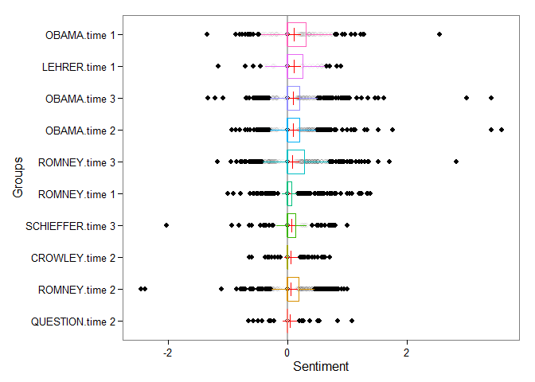
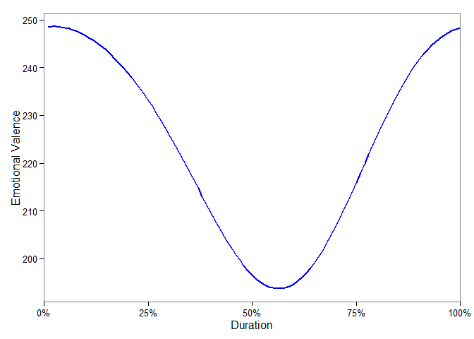

sentimentr
============

**sentimentr** is designed to quickly calulate text polarity sentiment
at the sentence level and optionally aggregate by rows or grouping
variable(s).

**sentimentr** is a response to my own needs with sentiment detection
that were not addressed by the current **R** tools. My own `polarity`
function in the **qdap** package is slower on larger data sets. It is a
dictionary lookup approach that tries to incorporate weighting for
valence shifters (negation and amplifiers/deamplifiers). Matthew
Jocker's created the
[**syuzhet**](http://www.matthewjockers.net/2015/02/02/syuzhet/) package
that utilizes dictionary lookups for the Bing, NRC, and Afinn methods.
He also utilizes a wrapper for the [Stanford
coreNLP](http://nlp.stanford.edu/software/corenlp.shtml) which uses much
more sophisticated analysis. Jocker's dictionary methods are fast but
are more prone to error in the case of valence shifters. Jocker's
[addressed these
critiques](http://www.matthewjockers.net/2015/03/04/some-thoughts-on-annies-thoughts-about-syuzhet/)
explaining that the method is good with regard to analyzing general
sentiment in a piece of literature. He points to the accuracy of the
Stanford detection as well. In my own work I need better accuracy than a
simple dictionary lookup; something that considers valence shifters yet
optimizes speed which the Stanford's parser does not. This leads to a
trade off of speed vs. accuracy. The equation below describes the
dictionary method of **sentimentr** that may give better results than a
dictionary approach that does not consider valence shifters but will
likely still be less accurate than Stanford's approach. Simply,
**sentimentr** attempts to balance accuracy and speed.

Table of Contents
============

-   [The Equation](#the-equation)
-   [Installation](#installation)
-   [Usage](#usage)
-   [Examples](#examples)
    -   [Annie Swafford's Examples](#annie-swaffords-examples)
-   [Contact](#contact)

The Equation
============

The equation used by the algorithm to assign value to polarity of each
sentence fist utilizes the sentiment dictionary (Hu and Liu,
[2004](http://www.cs.uic.edu/~liub/publications/kdd04-revSummary.pdf))
to tag polarized words. Each paragraph
(*p**i* = {*s*1, *s*2, ..., *s**n*})
composed of sentences, is broken into element sentences
(*s**i*, *j* = {*w*1, *w*2, ..., *w**n*})
where *w* are the words within sentences. Each sentence
(*s**j*) is broken into a an ordered bag of words.
Punctuation is removed with the exception of pause punctuations (commas,
colons, semicolons) which are considered a word within the sentence. I
will denote pause words as *c**w* (comma words) for convenience. We can
represent these words as an i,j,k notation as
*w**i*, *j*, *k*. For example *w*3, 2, 5 would be
the fifth word of the second sentence of the third paragraph. While I
use the term paragraph this merely represent a complete turn of talk.
For example t may be a cell level response in a questionnaire composed
of sentences.

The words in each sentence (*w**i*, *j*, *k*) are searched
and compared to a modified version of Hu, M., & Liu, B.'s (2004)
dictionary of polarized words. Positive
(*w**i*, *j*, *k* + ) and negative
(*w**i*, *j*, *k* − ) words are tagged with a  + 1
and  − 1 respectively (or other positive/negative weighting if the user
provides the sentiment dictionary). I will denote polarized words as
*p**w* for convenience. These will form a polar cluster
(*c**i*, *j*, *l*) which is a subset of the a sentence
(*c**i*, *j*, *l* ⊆ *s**i*, *j*).

The polarized context cluster (*c**i*, *j*, *l*) of words is
pulled from around the polarized word ($pw}) and defaults to 4 words
before and two words after *p**w*) to be considered as valence shifters.
The cluster can be represented as
(*c**i*, *j*, *l* = {*p**w**i*, *j*, *k* − *n**b*, ..., *p**w**i*, *j*, *k*, ..., *p**w**i*, *j*, *k* − *n**a*}),
where *n**b* & *n**a* are the parameters `n.before` and `n.after` set by
the user. The words in this polarized context cluster are tagged as
neutral (*w**i*, *j*, *k*0), negator
(*w**i*, *j*, *k**n*), amplifier
(*w**i*, *j*, *k**a*), or de-amplifier
(*w**i*, *j*, *k**d*). Neutral words hold no value
in the equation but do affect word count (*n*). Each polarized word is
then weighted (*w*) based on the weights from the `polarity_dt` argument
and then further weighted by the function and number of the valence
shifters directly surrounding the positive or negative word (*p**w*).
Pause (*c**w*) locations (punctuation that denotes a pause including
commas, colons, and semicolons) are indexed and considered in
calculating the upper and lower bounds in the polarized context cluster.
This is because these marks indicate a change in thought and words prior
are not necessarily connected with words after these punctuation marks.
The lower bound of the polarized context cluster is constrained to
max{*p**w**i*, *j*, *k* − *n**b*, 1, max{*c**w**i*, *j*, *k* \< *p**w**i*, *j*, *k*}}
and the upper bound is constrained to
min{*p**w**i*, *j*, *k* + *n**a*, *w**i*, *j**n*, min{*c**w**i*, *j*, *k* \> *p**w**i*, *j*, *k*}}
where *w**i*, *j**n* is the number of words in the sentence.

The core value in the cluster, the polarized word is acted upon by
valence shifters. Amplifiers increase the polarity by 1.8 (.8 is the
default weight (*z*)). Amplifiers
(*w**i*, *j*, *k**a*) become de-amplifiers if the
context cluster contains an odd number of negators
(*w**i*, *j*, *k**n*). De-amplifiers work to
decrease decrease the polarity. Negation
(*w**i*, *j*, *k**n*) acts on
amplifiers/de-amplifiers as discussed but also flip the sign of the
polarized word. Negation is determined by raising  − 1 to the power of
the number of negators (*w**i*, *j*, *k**n*) plus
2. Simply, this is a result of a belief that two negatives equal a
positive, 3 negatives a negative and so on.

The "but" conjunctions (i.e., 'but', 'however', and 'although') also
weight the context cluster. A but conjunction before the polarized word
up-weights the cluster by 1.85 (.85 is the default weight
(*z*2)). A but conjunction after the polarized word
down-weights the cluster by 1 - .85 (*z*2). The number of
occurrences before and after the polarized word are multiplied by 1
and -1 respectively and then summed within context cluster. It is this
value that is multiplied by the weight and added to 1.This corresponds
to the belief that a but makes the next clause of greater values while
lowering the value placed on the prior clause.

The researcher may provide a weight (*z*) to be utilized with
amplifiers/de-amplifiers (default is .8; de-amplifier weight is
constrained to  − 1 lower bound). Last, these weighted context clusters
(*c**i*, *j*, *l*) are summed (*c*′*i*, *j*) and
divided by the square root of the word count
(√*w**i*, *j**n*) yielding an unbounded polarity score
(*δ**i*, *j*) for each sentence.

*δ**i**j* =
<em>c</em>'*i**j*/√*w**i**j**n*

Where:

*c*′*i*, *j* = ∑((1 + *w**a**m**p* + *w**d**e**a**m**p*) ⋅ *w**i*, *j*, *k**p*( − 1)2 + *w**n**e**g*)

*w**a**m**p* = ∑(*w**n**e**g* ⋅ (*z* ⋅ *w**i*, *j*, *k**a*))

*w**d**e**a**m**p* = max(*w**d**e**a**m**p*′,  − 1)

*w**d**e**a**m**p*′ = ∑(*z*( − *w**n**e**g* ⋅ *w**i*, *j*, *k**a* + *w**i*, *j*, *k**d*))

*w**b* = 1 + *z*2 \* *w**b*′

*w**b*′ = ∑(|*w**b**u**t**c**o**n**j**u**n**c**t**i**o**n*|, ..., *w**i*, *j*, *k**p*, *w**i*, *j*, *k**p*, ..., |*w**b**u**t**c**o**n**j**u**n**c**t**i**o**n*| \*  − 1)

*w**n**e**g* = (∑*w**i*, *j*, *k**n* )
mod 2

To get the mean of all sentences (*s**i*, *j*) within a
paragraph (*p**i*) simply take the average sentiment score
*p**i*, *δ**i*, *j* = 1/n  ⋅  ∑
*δ**i*, *j*.

Installation
============

To download the development version of **sentimentr**:

Download the [zip
ball](https://github.com/trinker/sentimentr/zipball/master) or [tar
ball](https://github.com/trinker/sentimentr/tarball/master), decompress
and run `R CMD INSTALL` on it, or use the **pacman** package to install
the development version:

    if (!require("pacman")) install.packages("pacman")
    pacman::p_load_gh("trinker/sentimentr")

Usage
=====

There are two main functions in **sentimentr** with three helper
functions summarized in the table below:

<table>
<thead>
<tr class="header">
<th align="left">Function</th>
<th align="left">Description</th>
</tr>
</thead>
<tbody>
<tr class="odd">
<td align="left"><code>sentiment</code></td>
<td align="left">Sentiment at the sentence level</td>
</tr>
<tr class="even">
<td align="left"><code>sentiment_by</code></td>
<td align="left">Aggregated sentiment by group(s)</td>
</tr>
<tr class="odd">
<td align="left"><code>uncombine</code></td>
<td align="left">Extract sentence level sentiment from <code>sentiment_by</code></td>
</tr>
<tr class="even">
<td align="left"><code>get_sentences</code></td>
<td align="left">Regex based string to sentence parser (or get sentences from <code>sentiment</code>/<code>sentiment_by</code>)</td>
</tr>
<tr class="odd">
<td align="left"><code>replace_emoticon</code></td>
<td align="left">Replace emoticons with word equivalent</td>
</tr>
</tbody>
</table>

Examples
========

    if (!require("pacman")) install.packages("pacman")
    pacman::p_load(sentimentr)

    mytext <- c(
        'do you like it?  But I hate really bad dogs',
        'I am the best friend.',
        'Do you really like it?  I\'m not a fan'
    )
    sentiment(mytext)

    ##    element_id sentence_id word_count  sentiment
    ## 1:          1           1          4  0.5000000
    ## 2:          1           2          6 -2.6781088
    ## 3:          2           1          5  0.4472136
    ## 4:          3           1          5  0.8049845
    ## 5:          3           2          4  0.0000000

To aggregate by element (column cell or vector element) use
`sentiment_by` with `by = NULL`.

    mytext <- c(
        'do you like it?  But I hate really bad dogs',
        'I am the best friend.',
        'Do you really like it?  I\'m not a fan'
    )
    sentiment_by(mytext)

    ##    element_id word_count       sd ave_sentiment
    ## 1:          1         10 2.247262    -1.0890544
    ## 2:          2          5       NA     0.4472136
    ## 3:          3          9 0.569210     0.4024922

To aggregate by grouping variables use `sentiment_by` using the `by`
argument.

    (out <- with(presidential_debates_2012, sentiment_by(dialogue, list(person, time))))

    ##        person   time word_count        sd ave_sentiment
    ##  1:     OBAMA time 1       3598 0.4397613    0.10966120
    ##  2:    LEHRER time 1        765 0.3493838    0.10941383
    ##  3:     OBAMA time 3       7241 0.4135144    0.09654523
    ##  4:     OBAMA time 2       7476 0.3832811    0.08893467
    ##  5:    ROMNEY time 3       8302 0.3909338    0.08108205
    ##  6:    ROMNEY time 1       4085 0.3510066    0.06613552
    ##  7: SCHIEFFER time 3       1445 0.3772378    0.06515716
    ##  8:   CROWLEY time 2       1672 0.2125288    0.05531121
    ##  9:    ROMNEY time 2       7534 0.3188779    0.04946325
    ## 10:  QUESTION time 2        583 0.3255268    0.03334828

    plot(out)

    ## Warning: Removed 2 rows containing non-finite values (stat_boxplot).

    ## Warning: Removed 2 rows containing missing values (geom_point).

    plot(uncombine(out))

Annie Swafford's Examples
-------------------------

[Annie
Swafford](https://annieswafford.wordpress.com/2015/03/02/syuzhet/)
critiqued Jocker's approach to sentiment and gave the following examples
of sentences (`ase` for Annie Swafford example). Here I test each of
Jocker's 3 dictionary approaches (Bing, NRC, Afinn), his Stanford
wrapper (note I use my own [GitHub Stanford wrapper
package](https://github.com/trinker/stansent) based off of Jocker's
approach as it works more reliably on my own Windows machine), and my
own algorithm with both the default [Hu & Liu
(2004)](https://www.aaai.org/Papers/AAAI/2004/AAAI04-119.pdf) polarity
lexicon as well as [Baccianella, Esuli and Sebastiani's
(2010)](http://sentiwordnet.isti.cnr.it/) SentiWord lexicon.

    if (!require("pacman")) install.packages("pacman")
    pacman::p_load_gh("trinker/sentimentr", "trinker/stansent")
    pacman::p_load(syuzhet, qdap, microbenchmark)

    ase <- c(
        "I haven't been sad in a long time.",
        "I am extremely happy today.",
        "It's a good day.",
        "But suddenly I'm only a little bit happy.",
        "Then I'm not happy at all.",
        "In fact, I am now the least happy person on the planet.",
        "There is no happiness left in me.",
        "Wait, it's returned!",
        "I don't feel so bad after all!"
    )

    syuzhet <- setNames(as.data.frame(lapply(c("bing", "afinn", "nrc"),
        function(x) get_sentiment(ase, method=x))), c("bing", "afinn", "nrc"))

    left_just(data.frame(
        stanford = sentiment_stanford(ase),
        hu_liu = round(sentiment(ase, question.weight = 0)[["sentiment"]], 2),
        sentiword = round(sentiment(ase, sentiword, question.weight = 0)[["sentiment"]], 2),    
        syuzhet,
        sentences = ase,
        stringsAsFactors = FALSE
    ), "sentences")

      stanford hu_liu sentiword bing afinn nrc
    1      0.5      0      0.27   -1    -2   0
    2       -1    0.8      0.65    1     3   1
    3     -0.5    0.5      0.32    1     3   1
    4      0.5      0         0    1     3   1
    5      0.5  -0.41     -0.56    1     3   1
    6      0.5   0.06      0.05    1     3   1
    7      0.5  -0.38     -0.05    1     2   1
    8        0      0     -0.14    0     0  -1
    9      0.5   0.38      0.24   -1    -3  -1
      sentences                                              
    1 I haven't been sad in a long time.                     
    2 I am extremely happy today.                            
    3 It's a good day.                                       
    4 But suddenly I'm only a little bit happy.              
    5 Then I'm not happy at all.                             
    6 In fact, I am now the least happy person on the planet.
    7 There is no happiness left in me.                      
    8 Wait, it's returned!                                   
    9 I don't feel so bad after all!                         

Also of interest is the computational time used by each of these
methods. To demonstrate this I increased Annie's examples by 100
replications and **microbenchmark** on a few iterations (Stanford takes
so long I didn't extend to more). Note that if a text needs to be broken
into sentence parts **syuzhet** has the `get_sentences` function that
uses the **openNLP** package, this is a time expensive task.
**sentimentr** uses a much faster regex based approach that is nearly as
accurate in parsing sentences with a much lower computational time. We
see that Stanford takes the longest time while **sentimentr** and
**syuzhet** are comparable depending upon lexicon used.

    ase_100 <- rep(ase, 100)

    stanford <- function() {sentiment_stanford(ase_100)}

    sentimentr_hu_liu <- function() sentiment(ase_100)
    sentimentr_sentiword <- function() sentiment(ase_100, sentiword) 
        
    syuzhet_binn <- function() get_sentiment(ase_100, method="bing")
    syuzhet_nrc <- function() get_sentiment(ase_100, method="nrc")
    syuzhet_afinn <- function() get_sentiment(ase_100, method="afinn")
         
    microbenchmark(
        stanford(),
        sentimentr_hu_liu(),
        sentimentr_sentiword(),
        syuzhet_binn(), 
        syuzhet_nrc(),
        syuzhet_afinn(),
        times = 3
    )

    Unit: milliseconds
                       expr        min         lq       mean     median
                 stanford() 21429.9149 21533.7647 21835.5865 21637.6146
        sentimentr_hu_liu()   185.2158   187.2156   209.0417   189.2154
     sentimentr_sentiword()   774.3885   787.3515   866.3429   800.3145
             syuzhet_binn()   270.4358   314.7852   355.9027   359.1347
              syuzhet_nrc()   643.3126   675.7741   686.8932   708.2356
            syuzhet_afinn()   154.3818   186.9069   210.4344   219.4320
             uq        max neval
     22038.4224 22439.2301     3
       220.9547   252.6940     3
       912.3201  1024.3257     3
       398.6362   438.1377     3
       708.6835   709.1314     3
       238.4608   257.4896     3

Contact
=======

You are welcome to: 
* submit suggestions and bug-reports at: <https://github.com/trinker/sentimentr/issues> 
* send a pull request on: <https://github.com/trinker/sentimentr/> 
* compose a friendly e-mail to: <tyler.rinker@gmail.com>
